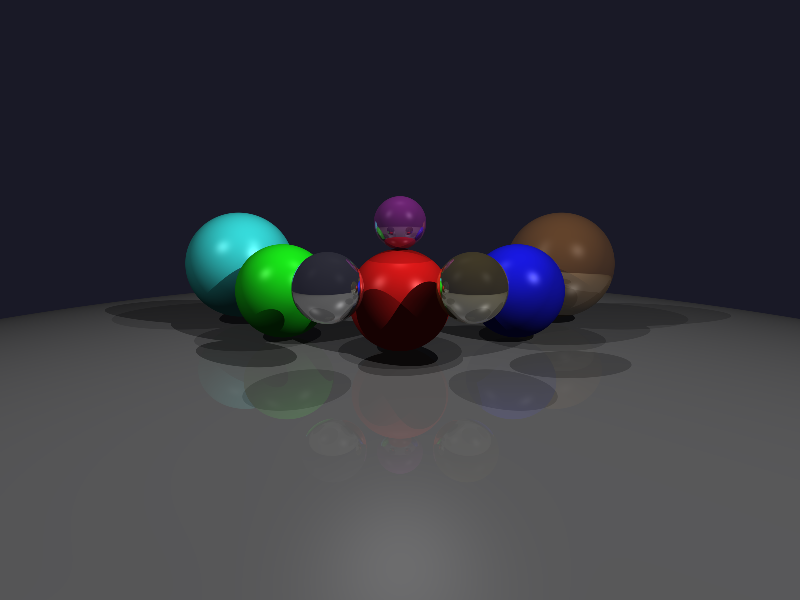

# Raytracer

A path tracer written in Rust with both CPU and GPU (wgpu/WGSL) backends.



https://github.com/user-attachments/assets/demo.mp4

## Features

- **Dual backends**: CPU (single-threaded) and GPU (wgpu compute shaders)
- **Progressive rendering**: Accumulates samples over time for cleaner results
- **Reflections**: Recursive ray bouncing with configurable max depth
- **Soft shadows**: Multiple light sources with proper shadow rays
- **Primitives**: Spheres, triangles, and convex polygons
- **Animation mode**: Orbital camera fly-around with video output

## Performance

On a GTX 1080 rendering 800×600 with 9 objects:

| Backend | Samples/sec | Speedup |
|---------|-------------|---------|
| CPU     | ~10         | 1×      |
| GPU     | ~2500       | ~250×   |

## Usage

```bash
# Build
cargo build --release

# Single frame (time-limited)
./target/release/raytracer scene.json output.png [time_ms] [--cpu|--gpu]

# Animation (sample-limited per frame)
./target/release/raytracer scene.json output_dir --animate <seconds> <fps> [samples_per_frame]
```

### Examples

```bash
# Render for 2 seconds on GPU
./target/release/raytracer scenes/scene2_many.json render.png 2000 --gpu

# 5-second animation at 30fps, 200 samples per frame
./target/release/raytracer scenes/scene2_many.json frames --animate 5 30 200 --gpu

# Combine frames into video
ffmpeg -framerate 30 -i frames/frame_%05d.png -c:v libx264 -pix_fmt yuv420p output.mp4
```

## Scene Format

Scenes are defined in JSON:

```json
{
  "width": 800,
  "height": 600,
  "max_bounces": 3,
  "background": { "r": 0.1, "g": 0.1, "b": 0.15 },
  "camera": {
    "position": { "x": 0, "y": 2, "z": 5 },
    "look_at": { "x": 0, "y": 0, "z": -5 },
    "fov": 60
  },
  "spheres": [
    {
      "center": { "x": 0, "y": 0, "z": -5 },
      "radius": 1.0,
      "color": { "r": 0.9, "g": 0.1, "b": 0.1 },
      "reflectivity": 0.0
    }
  ],
  "lights": [
    {
      "position": { "x": 10, "y": 10, "z": 5 },
      "intensity": 1.0
    }
  ]
}
```

## Requirements

- Rust 1.70+
- Vulkan or Metal GPU (for GPU backend)

## License

MIT
